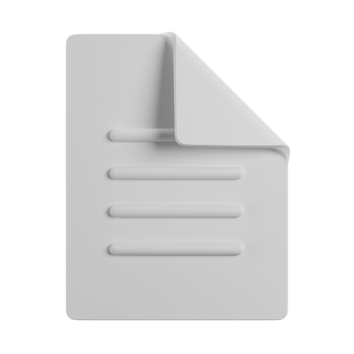

# 📄 FileConverter

**FileConverter** is a web application that allows you to convert files between multiple formats such as HTML, CSV, PDF, and DOCX. It uses the ConvertAPI to perform conversions directly from the browser, without the need for a backend or local installations, helping to reduce costs and development time.

App create for Angel Aquino

## 🚀 Features

- ✅ HTML to PDF conversion
- ✅ CSV to PDF conversion
- ✅ PDF to DOCX conversion
- ✅ DOCX/DOC to PDF conversion
- ✅ User-friendly drag-and-drop interface
- ✅ Image preview
- ✅ Success/error notifications with `react-hot-toast`
- ✅ Responsive design with TailwindCSS

## 🧪 Technologies used

- [React](https://react.dev/)
- [TypeScript](https://www.typescriptlang.org/)
- [FilePond](https://pqina.nl/filepond/)
- [ConvertAPI](https://www.convertapi.com/)
- [TailwindCSS](https://tailwindcss.com/)
- [React Hot Toast](https://react-hot-toast.com/)

## 📦 Installation

1. Clone the repository:

git clone https://github.com/a3xxx23/FileConverter.git
cd file-converter

2. Install the dependencies:

npm install

3. Create an .env file and add your ConvertAPI key:

VITE_PROJECT_URL_SUPABASE = supabase_key

VITE_SUPABASE_API_KEY = api_key

VITE_CONVERTAPI_KEY = convertapi_key

4. Run the application:

npm run dev

5. Open your browser and navigate to http://localhost:5173/ to see the application in action.

